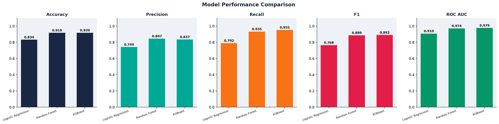
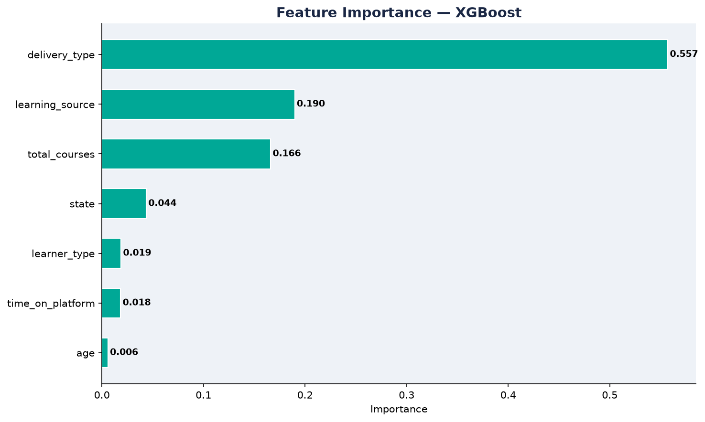
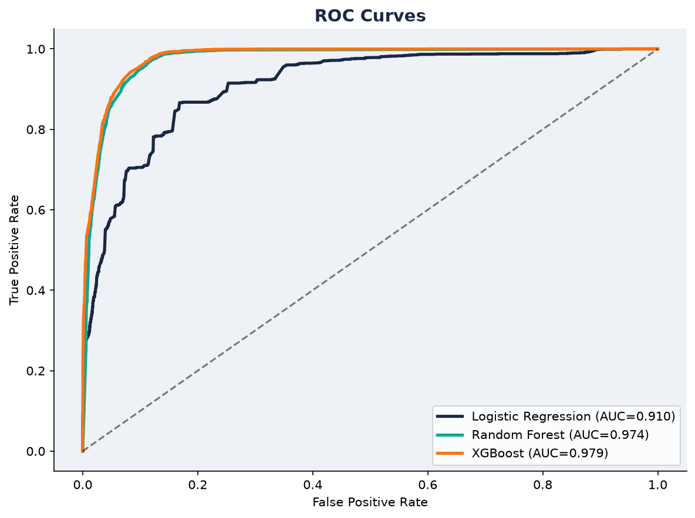
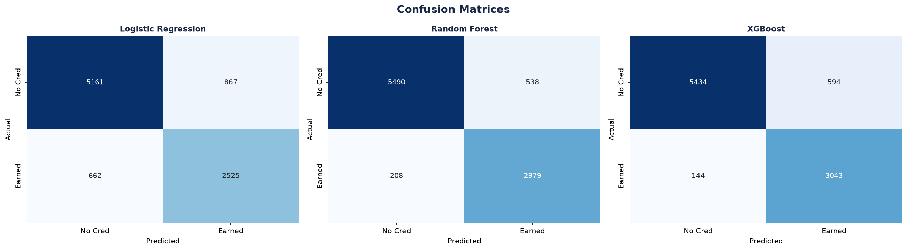

# ibm-skillsbuild-credential-prediction


# An end-to-end machine learning pipeline for predicting IBM SkillsBuild digital credential attainment and generating prioritized learner outreach recommendations for Learning Links Foundation.

---

##  Project Overview

Many learners register on the IBM SkillsBuild platform, but only a fraction complete enough learning activities to earn an IBM Digital Credential. Since trainers have limited time and resources, identifying learners who are least likely to achieve a credential enables targeted interventions and improves learner success.

This project develops an end-to-end machine learning pipeline that predicts whether a learner will earn an IBM Digital Credential and ranks learners based on their need for follow-up support.

##  Project Workflow

```text
                  IBM SkillsBuild Reports
         (Learning Transcripts & Credentials)
                              │
                              ▼
                  Data Cleaning & Validation
        - Handle missing values
        - Parse date formats
        - Remove redundant columns
                              │
                              ▼
                    Feature Engineering
        - Time on Platform
        - Last Activity Date
        - Course Aggregation
        - Leakage-free Feature Selection
                              │
                              ▼
                     Data Preprocessing
        - Aggregate to Learner Level
        - Encode Categorical Features
        - Median Imputation
        - Train/Test Split
        - SMOTE for Class Balancing
                              │
                              ▼
                 Machine Learning Models
        • Logistic Regression
        • Random Forest
        • XGBoost
                              │
                              ▼
                    Model Evaluation
        - Accuracy
        - Precision
        - Recall
        - F1 Score
        - ROC-AUC
        - Cross Validation
                              │
                              ▼
                Best Model Selection (XGBoost)
                              │
                              ▼
                   Learner Probability Scoring
                              │
                              ▼
            Prioritized Outreach Recommendation
                              │
                              ▼
             High-Priority Learner List for LLF
```

##  Project Highlights

- Developed an end-to-end machine learning pipeline for predicting IBM SkillsBuild digital credential attainment.
- Processed and analyzed **415,142+ learning records** from **46,073 unique learners**.
- Engineered leakage-free features to ensure reliable and trustworthy model performance.
- Compared multiple machine learning algorithms, with **XGBoost** achieving the best results.
- Achieved an **F1-score of 89.2%** and **ROC-AUC of ~0.98**.
- Generated an automated **priority outreach list** to help trainers identify learners requiring timely intervention.
---

##  Problem Statement

Learning Links Foundation (LLF), an implementation partner of IBM SkillsBuild, registers thousands of learners every year. However, trainers currently have no data-driven method to identify learners who require additional support.

The objective of this project is to predict credential attainment using learner engagement data and generate a prioritized outreach list that enables trainers to focus on learners who need intervention the most.

---

##  Features

- End-to-end machine learning pipeline
- Data cleaning and preprocessing
- Feature engineering
- Prevention of data leakage through careful feature selection
- Handling class imbalance using SMOTE
- Comparison of multiple classification models
- Model evaluation using multiple performance metrics
- Automated learner scoring and outreach prioritization
- Modular and reusable pipeline

---

##  Tech Stack

- Python
- Pandas
- NumPy
- Scikit-learn
- XGBoost
- Imbalanced-learn (SMOTE)
- Matplotlib
- Seaborn
- OpenPyXL
- Joblib

---

##  Dataset

The original project uses IBM SkillsBuild learner transcript reports and digital credential reports provided through Learning Links Foundation.

**Note:** The original dataset is confidential and is **not included** in this repository.

---

##  Machine Learning Pipeline

1. Data Cleaning
2. Feature Engineering
3. Exploratory Data Analysis
4. Feature Selection
5. Data Preprocessing
6. Model Training
7. Model Evaluation
8. Model Diagnostics
9. Learner Scoring
10. Outreach Priority List Generation

---

##  Models Compared

- Logistic Regression
- Random Forest
- XGBoost (Best Performing Model)
### Model Comparison

The figure below shows the model comparison between Logistic Regression, Random Forest and XGBoost.


---

##  Model Performance

| Metric | Score |
|--------|--------|
| Accuracy | 92.0% |
| Precision | 83.7% |
| Recall | 95.5% |
| F1 Score | 89.2% |
| ROC-AUC | ~0.98 |

The XGBoost model achieved the best overall performance while maintaining strong generalization and avoiding data leakage.


### Feature Importance

The figure below shows the relative importance of the features used by the XGBoost model.



---

### ROC Curve

The ROC Curve demonstrates the model's ability to distinguish between learners who earn digital credentials and those who do not.



---

### Confusion Matrix

The confusion matrix summarizes the classification performance of the best-performing model on the test dataset.



---

##  Repository Structure

```
ibm-skillsbuild-credential-prediction/

├── data/
├── models/
├── outputs/
├── src/
├── notebooks/
├── README.md
├── requirements.txt
└── LICENSE
```

---

##  Installation

Clone the repository

```bash
git clone https://github.com/RakeshSainiDelhi42/ibm-skillsbuild-credential-prediction.git
```

Install dependencies

```bash
pip install -r requirements.txt
```

---

##  Disclaimer

This repository is intended for educational and portfolio purposes.

The original IBM SkillsBuild datasets contain confidential information and are **not publicly shared**. Any sample datasets included in this repository are anonymized or synthetic.

---

##  Author

**Rakesh Saini**

M.Tech (Data Science & Engineering)  
BITS Pilani

https://www.linkedin.com/in/rakeshsaini2014/

---

##  License

This project is licensed under the MIT License.
